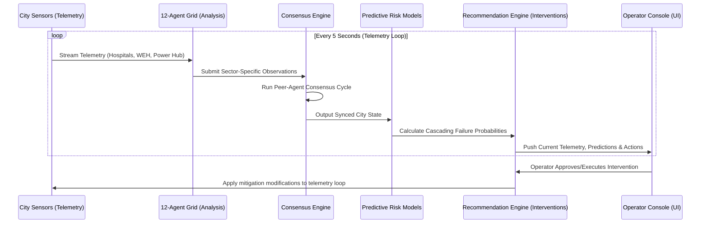
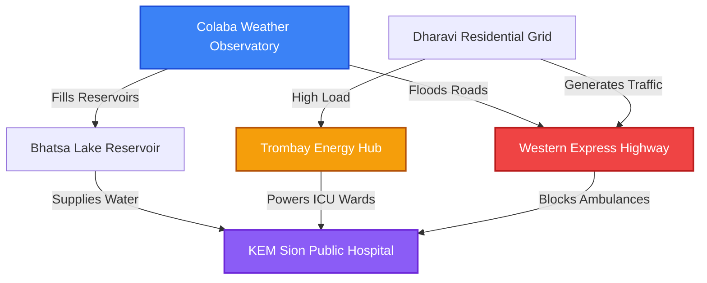

# NationTwin AI – The Living Digital Twin of a City

[](LICENSE)
[](https://fastapi.tiangolo.com)
[](https://nextjs.org)
[](https://reactflow.dev)
[](https://leafletjs.com)
[](https://nationtwin-ai.vercel.app/)
[](https://youtu.be/Y3SEDSnHtDE)

**NationTwin AI** is a modern, visually stunning, multi-agent cognitive digital twin designed to monitor, simulate, and recommend municipal responses for the city of Mumbai. Built with a pluggable architecture, it coordinates **12 independent agent blocks** (representing weather, transit, healthcare, energy, and emergency departments) to predict cascading system failures and optimize mitigation pathways under extreme stress.

🔗 **Live Demo**: [https://nationtwin-ai.vercel.app/](https://nationtwin-ai.vercel.app/)  
🎥 **YouTube Demo**: [Watch the Cinematic Tour](https://youtu.be/Y3SEDSnHtDE)

<p align="center">
  <a href="https://youtu.be/Y3SEDSnHtDE" target="_blank">
    
  </a>
</p>

---

## 📌 Table of Contents

- [📖 Project Overview](#-project-overview)
- [✨ Key Features](#-key-features)
- [🏗️ System Architecture](#️-system-architecture)
- [💻 Tech Stack](#-tech-stack)
- [📁 Folder Structure](#-folder-structure)
- [🚀 Installation & Setup](#-installation--setup)
- [⚙️ Environment Variables](#️-environment-variables)
- [🤖 Multi-Agent Workflow](#-multi-agent-workflow)
- [📡 API Documentation](#-api-documentation)
- [🧪 Simulation Scenarios](#-simulation-scenarios)
- [🗺️ Roadmap](#️-roadmap)
- [🤝 Contributing](#-contributing)
- [📝 License](#-license)
- [📞 Contact & Support](#-contact--support)

---

## 📖 Project Overview

Modern cities are hyper-connected systems of systems. A failure in one sector (e.g., a monsoon flooding a major highway) quickly cascades into other sectors (e.g., ambulances blocked, energy substations short-circuiting, hospital ICUs losing backup power). 

**NationTwin AI** resolves this complexity by modeling municipal sectors as a directed dependency graph. It runs continuous consensus loops where specialized autonomous agents analyze telemetry, calculate threat levels, and propose optimized interventions alongside expected cost-benefit matrices to protect lives and infrastructure.

---

## ✨ Key Features

*   **🤖 12-Agent Consensus Grid**: Independent agents (Weather, Traffic, Hospital, Water, Energy, etc.) monitor metrics, negotiate risk priorities, and reach consensus.
*   **📊 World Model Graph**: An interactive React Flow network mapping dependencies (e.g., *Reservoir Gates* supply *Water Mains* which feed *Hospital Wards*).
*   **🌦️ Simulative Sandbox**: Ingest extreme stress events like monsoon rain surges, traffic gridlocks, or energy failures, and observe recovery curves in real time.
*   **🗺️ Interactive GIS Map**: Leaflet-powered geographic dashboard with glowing sensor beacons, highway speed overlays, and active threat heatmaps.
*   **⚡ Predictive Intelligence**: Calculates flood hazard probability, grid congestion, and ICU saturation up to 6 hours in advance.
*   **🔌 Pluggable Architecture**: Out-of-the-box operation using Mock telemetry, easily toggled to production databases (PostgreSQL, Redis, Neo4j).

---

## 🏗️ System Architecture

NationTwin AI operates on a feedback loop of **Sensors -> Multi-Agent Analysis -> Consensus -> Prediction -> Recommendation -> Operator Action**.



### World Model Dependency Graph (Simplified)



---

## 💻 Tech Stack

| Component | Technology | Description |
| :--- | :--- | :--- |
| **Backend Core** | FastAPI | High-performance async Python framework. |
| **Database ORM** | SQLModel (SQLAlchemy) | Type-safe database queries. |
| **State Caching** | Redis (Mock Driver) | In-memory pub-sub sync. |
| **Graph DB** | Neo4j (Mock Driver) | Dependency mapping store. |
| **Frontend Core** | Next.js (React 19) | Modern SSR/CSR application framework. |
| **Graph Visualization**| React Flow | Interactive drag-and-drop world model node graph. |
| **Map Rendering** | Leaflet & React Leaflet | Geographical vector overlay maps. |
| **Styling** | CSS Variables & Tailwind | High-end glassmorphism dark-mode UI. |

---

## 📁 Folder Structure

```filename
├── backend/
│   ├── app/
│   │   ├── agents/          # 12 Autonomous Agents & Orchestrator
│   │   ├── core/            # Recommendation and Simulation Engines
│   │   ├── database.py      # SQLite connection & Mock drivers (Redis/Neo4j)
│   │   ├── main.py          # FastAPI application & startup threads
│   │   ├── routers.py       # REST API endpoints
│   │   └── schemas.py       # Pydantic state models
│   ├── requirements.txt     # Python dependencies
│   └── run.sh               # Local startup script using uv
├── frontend/
│   ├── src/
│   │   ├── app/             # Next.js Pages & Routes (Dashboard, Map, Sandbox)
│   │   ├── components/      # UI Cards, React Leaflet Map, React Flow Graph
│   │   └── lib/             # API client & Mock state fallback
│   ├── package.json         # Node dependencies
│   └── Dockerfile           # Frontend deployment config
└── marketing/               # Audio, Video & Graphic assets generator
```

---

## 🚀 Installation & Setup

### Prerequisites
- Python 3.10+
- Node.js 18+
- [uv](https://github.com/astral-sh/uv) (Fast Python Package Installer)

### 1. Backend Setup
1. Navigate to the backend folder:
   ```bash
   cd backend
   ```
2. Initialize virtual environment and install packages:
   ```bash
   uv venv .venv
   source .venv/bin/activate
   uv pip install -r requirements.txt
   ```
3. Start the FastAPI server:
   ```bash
   bash run.sh
   ```
   The backend will start on **`http://localhost:8000`** and automatically seed a local SQLite database (`nationtwin.db`).

### 2. Frontend Setup
1. Navigate to the frontend folder:
   ```bash
   cd ../frontend
   ```
2. Install npm dependencies:
   ```bash
   npm install
   ```
3. Start the Next.js development server:
   ```bash
   npm run dev
   ```
   The frontend console will be live on **`http://localhost:3000`**.

---

## ⚙️ Environment Variables

Copy the `.env.example` to `.env` in the root:
```bash
cp .env.example .env
```

| Variable | Default | Description |
| :--- | :--- | :--- |
| `MOCK_MODE` | `true` | When `true`, bypasses live Neo4j/Redis targets and uses SQLite history. |
| `UPDATE_INTERVAL_SECONDS` | `5` | Timer delay for real-time sensor loop sweeps. |
| `DATABASE_URL` | `sqlite:///./nationtwin.db` | Local persistent relational database path. |
| `GEMINI_API_KEY` | `""` | Optional. Used for LLM agent reasoning (consensus fallback). |

---

## 🤖 Multi-Agent Workflow

Each of the **12 agents** runs an independent assessment cycle:

1.  **Weather Agent**: Tracks temperature, rainfall precipitation, and monsoon vectors.
2.  **Traffic Agent**: Scrapes highway congestion levels and coordinates detour lanes.
3.  **Hospital Agent**: Tracks occupied ICU beds and matches emergency trauma units.
4.  **Energy Agent**: Audits power grid capacity, substation load, and blackouts.
5.  **Water Agent**: Monitors reservoir reservoir levels and water main pressures.
6.  **Transit, Waste, Telecom, Police, Fire, BMC, and Finance Agents**: Calculate cascading structural impacts.

---

## 📡 API Documentation

FastAPI automatically serves interactive Swagger docs at **`http://localhost:8000/docs`**.

### Key Endpoints

<details>
<summary><code>GET /api/city-state</code> — Get Latest Telemetry</summary>

Returns the comprehensive status of the city, including weather, traffic speeds, hospital beds, and grid capacities.
```json
{
  "weather": { "temperature": 29.5, "condition": "Rainy", "precipitation": 78 },
  "traffic": { "congestion_level": 45, "average_speed": 32 },
  "hospitals": { "occupied_beds": 820, "icu_occupancy": 74.5 },
  "energy": { "grid_load": 4200, "outages": [] }
}
```
</details>

<details>
<summary><code>POST /api/simulation/run</code> — Inject Scenario</summary>

Injects synthetic emergencies to evaluate model resilience.
```json
{
  "scenario": "monsoon_surge",
  "intensity": 1.2
}
```
</details>

<details>
<summary><code>POST /api/recommendations/{id}/action</code> — Trigger Intervention</summary>

Executes emergency protocols (e.g. `approve`, `reject`, or `execute` to trigger water release gates).
</details>

---

## 🧪 Simulation Scenarios

 Planners can trigger the following stress scenarios inside the Sandbox:

-   **`monsoon_surge`**: Injects torrential rain. Floods Western Express Highway, increases reservoir gates flow, and triggers power line trips.
-   **`grid_failure`**: Power plant shutdown. Drops Trombay Hub supply, forces KEM Sion hospital to backup generators, and halts electric rail transit.
-   **`road_blockage`**: Landslide or major traffic crash. Drives Western Express Highway congestion to 95% and delays hospital ambulance delivery.

---

## 🗺️ Roadmap

- [x] Multi-agent core consensus engine and background simulation loops.
- [x] Interactive UI with React Flow dependency modeling and Leaflet overlays.
- [x] Branded marketing media kit (1080p demo video, thumbnail, framed screenshots).
- [ ] Connect production Postgres, Redis, and Neo4j database layers (Toggle `MOCK_MODE=false`).
- [ ] Incorporate real-time Mumbai GIS data from municipal APIs.
- [ ] Introduce multi-modal Gemini Vision analysis on live traffic CCTV streams.

---

## 🤝 Contributing

Contributions are welcome! Please follow these steps:
1. Fork the Project.
2. Create a Feature Branch (`git checkout -b feature/AmazingFeature`).
3. Commit your changes (`git commit -m 'Add some AmazingFeature'`).
4. Push to the Branch (`git push origin feature/AmazingFeature`).
5. Open a Pull Request.

---

## 📝 License

Distributed under the MIT License. See [LICENSE](LICENSE) for more information.

---

## 📞 Contact & Support

- **Developer**: Abhishek Raj ([abhishekraj10001@gmail.com](mailto:abhishekraj10001@gmail.com))
- **Project Link**: [https://github.com/abhishekraj10001/nationtwin-ai](https://github.com/abhishekraj10001/nationtwin-ai)
